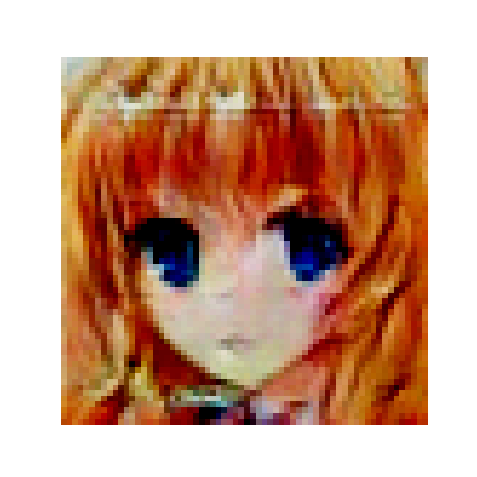

Prediction of the investor's class by transactions and the initial state of the portfolio
# Generating animge faces imges                           

Название                                   | Содержание
-------------------------------------------|----------------------
dcgan.ipynb                                | главный скрипт
-------------------------------------------|----------------------
VAE_training_and_generating.ipynb          | дополнительный скрипт

##                                                                    Описание

Датасет взят из kaggle datasets и состоит из 60000 изображений, размером не больше 80 х 80 пикселей. Были написаны две нейронные сети, каждая из которых генерировала изображения 64 х 64 пикселя. Vae показывает результаты хуже, в силу архитектуры, а вот DCGAN уже генерирует хорошие, четкие изображения 

##                                                                    Дополнительно
пример генерации VAE:

пример генерации DCGAN:

## :paw_prints: Контакты

**Telegram**: @suhowandrew
**VK**: [vk.com/suhowandrew](https://vk.com/suhowandrew)
  
  